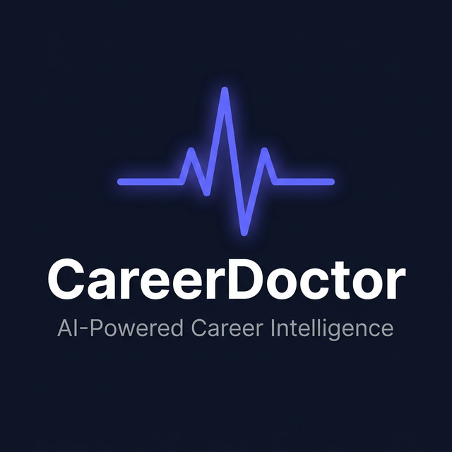

# 🩺 CareerDoctor

### Your career has symptoms. We have the diagnosis.

&nbsp;

---

 

> **Upload your resume. Get a full career diagnosis. Chat with an AI coach that actually updates your profile. Find jobs. Track applications. All in one place.**

 

## 🤖 Meet Doc

Doc is your personal AI career coach - but unlike other chatbots, **Doc doesn't just talk. Doc takes action.**

Tell Doc you want to switch careers. It won't just say *"great idea!"* - it'll propose a complete transition strategy with a new target role, a skill roadmap, and its reasoning. A sleek confirmation card appears. One tap on **"Apply Strategy"** and your entire profile - title, skills, summary, career trajectory - reshapes instantly.

> 💬 *"I want to become a Data Scientist"*
>
> 🎯 Doc proposes: **Data Scientist** + skills like Python, ML, Statistics, TensorFlow
>
> ✅ You click **Apply Strategy** → Profile updates. Analysis regenerates. Done.

No forms. No manual editing. Just a conversation.

 

## 🔬 Career Diagnosis

One click on **Analyze** and CareerDoctor reads your entire profile - every skill, every role, every gap - and produces a comprehensive career health report:

| | |
|---|---|
| 📊 **Profile Strength** | Competitiveness score with exactly what to fix |
| 📈 **Career Trajectory** | Now → 6 months → 1 year → 3 years |
| 🏆 **Role Matches** | Best-fit roles ranked by %, with salary in your local currency |
| ⚠️ **Skill Gaps** | What you're missing, how critical, how long to learn |
| ✅ **Action Plan** | What to do *this week* |
| 🏭 **Industry Fit** | Where your background is worth the most |
| 🔎 **Search Queries** | Exactly what to type into job boards |

 

## 📄 Resume → Full Profile. Instantly.

Upload a PDF. CareerDoctor extracts everything - name, title, skills, experience, education, projects, certifications, links, summary - and builds your complete profile automatically.

No forms. No typing. No copy-pasting from LinkedIn.

 

## 🔍 Job Search That Gets You

Search live job postings filtered by recency, type, seniority, and remote availability. Every listing has a direct apply link. Your career analysis even generates personalized search terms so you know *exactly* what to look for.

 

## 📊 Track Every Application

Follow each application from **Wishlist → Applied → Interview → Offer**. But it's not just a list:

- **Funnel Analytics** - See your conversion rates at every stage and spot where candidates are dropping off
- **AI Insights** - Get personalized tips based on your actual application data, companies, and roles
- **Behavioral Diagnosis** - The engine detects patterns (applying too late, targeting wrong company sizes, ignoring follow-ups) and tells you what to fix
- **Response Rate Tracking** - Know exactly how many companies are getting back to you

 

## 📧 Daily Career Digest

A personalized daily briefing powered by AI:

- **Tip of the Day** - Actionable career advice specific to your role and level (not generic "network more" fluff)
- **Skill Spotlight** - A skill you should learn next, with free resources (real links to freeCodeCamp, Coursera, YouTube)
- **Pipeline Status** - How many apps are pending, interviewing, or need follow-up
- **Follow-up Nudges** - "You applied to Company X 14 days ago with no response. Time to follow up."
- **Email Reports** - Get your full career analysis emailed to you as a beautifully formatted report

 

## 🎤 Interview Prep

Practice with AI-generated questions tailored to your target roles and actual experience. Not generic behavioral questions - questions based on *your* profile.

 

## ✨ The Little Things

🌙 Dark mode that actually looks stunning
📱 Fully responsive - looks great on any screen
🔐 Sign in with Google or GitHub
⚡ Multi-model AI cascade - 10+ models, zero downtime
🌍 Salary estimates in your local currency (₹, $, £, €, and more)
📄 Generate new resumes from your profile

 

---

**[→ Try CareerDoctor Now ←](https://career-doctor.vercel.app)**

Built with ❤️ by **[Poulastha Mukherjee](https://www.linkedin.com/in/poulastha-mukherjee/)**

© 2026 Poulastha Mukherjee. All rights reserved.

